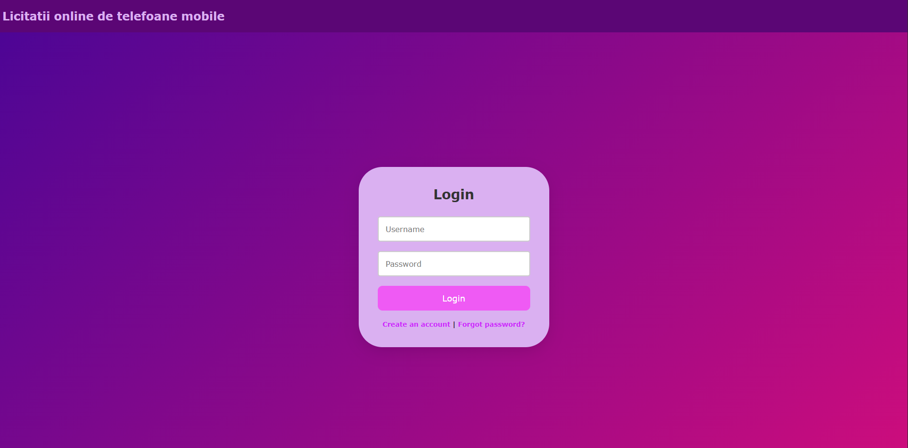
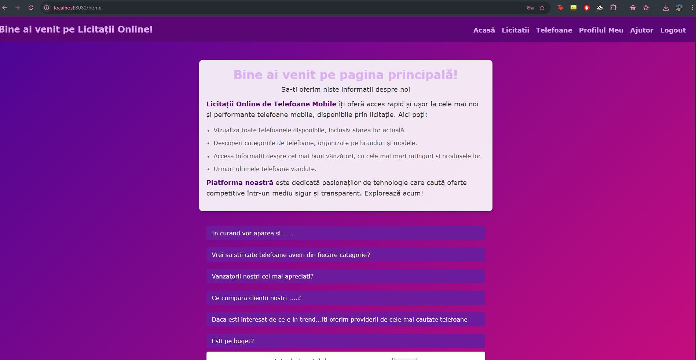
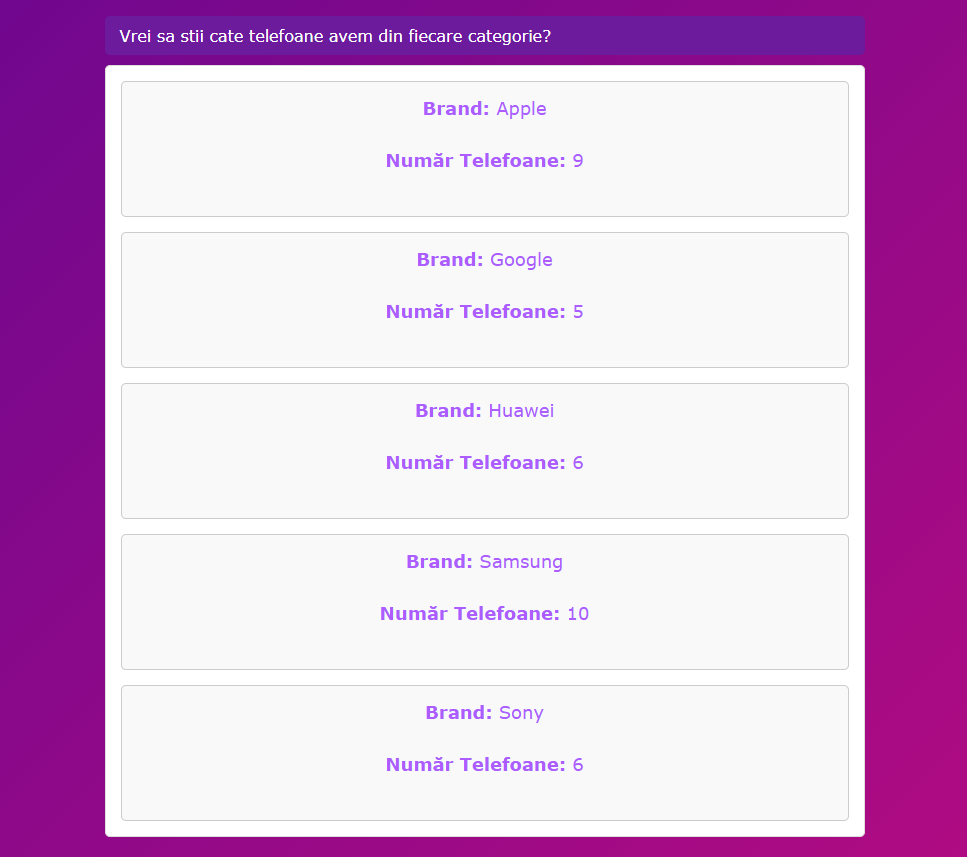
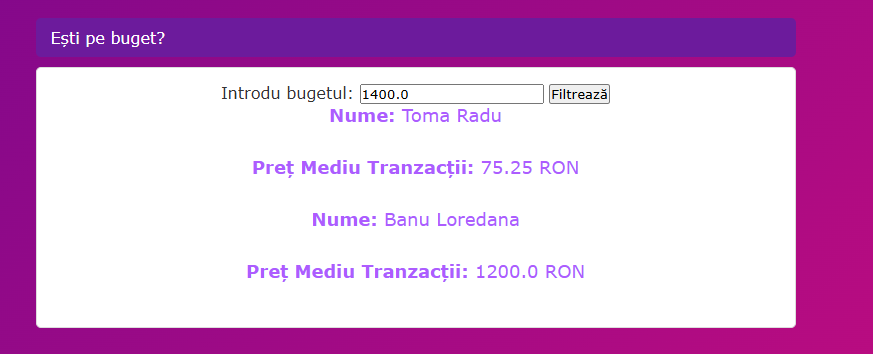
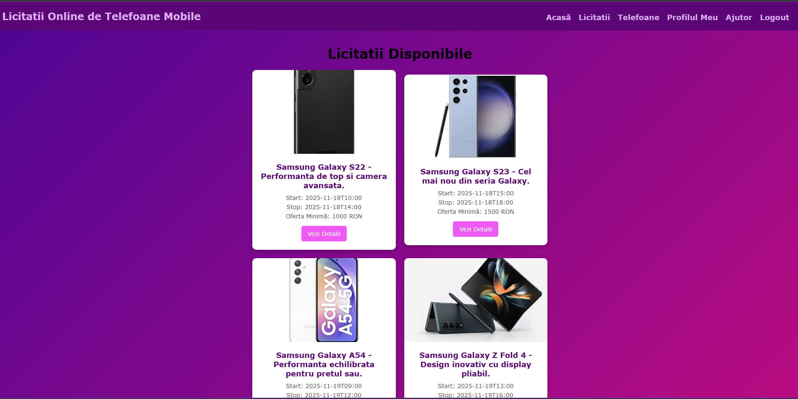
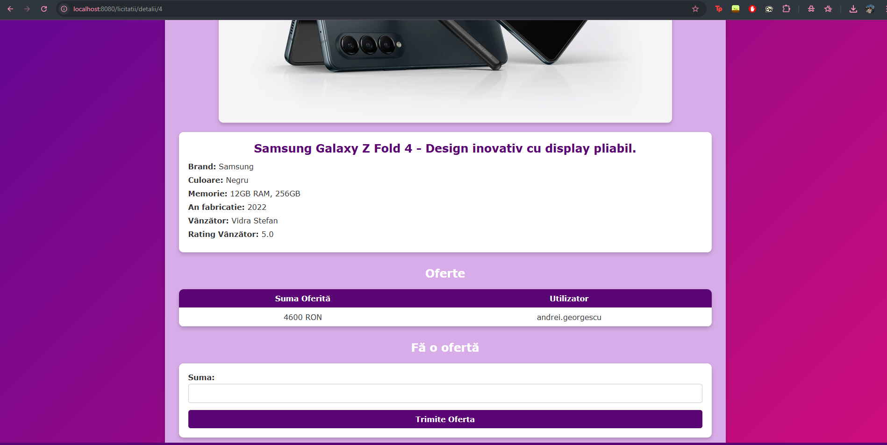
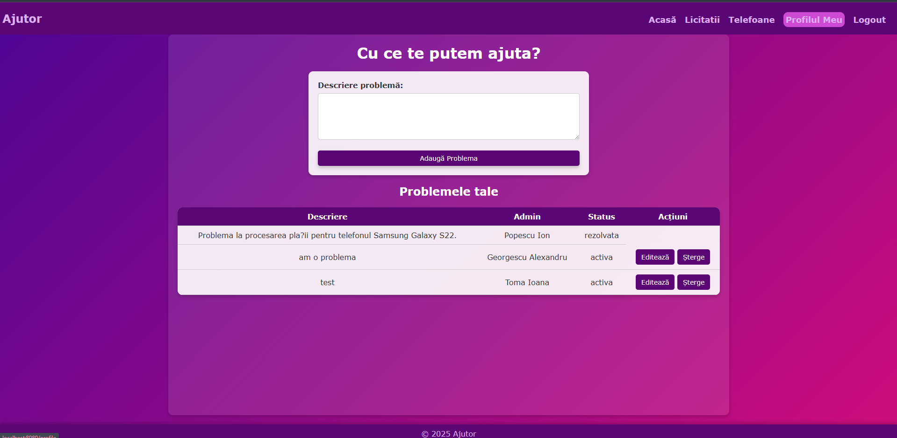
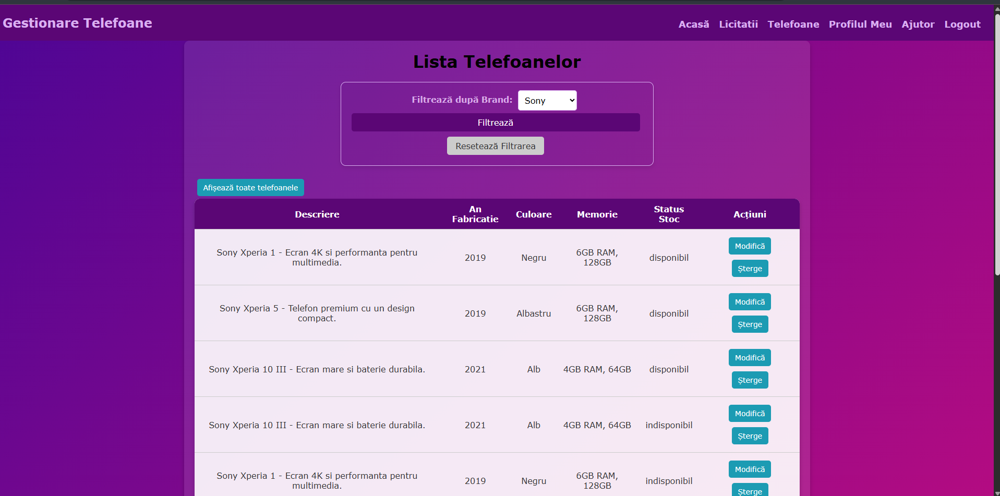

# Online Auction for Smartphones

A Java Spring Boot web application that allows users to auction, bid, and filter smartphones in an online system. The user can also report a problem which will be automatically assigned to an admin, change profile details,
add phones to the market, remove or edit them.

---

## Project Structure

- `controller/` – Handles HTTP requests and routing logic
- `model/` – Contains entity classes (users, phones, bids, etc.)
- `repository/` – Spring Data JPA interfaces for database access
- `service/` – Business logic layer
- `config/` – Application configuration (DB, security, etc.)

---

## Technologies Used

- Java 17
- Spring Boot
- Spring Data JPA
- Thymeleaf
- SQL Server (via JDBC)
- HTML, CSS
- Maven

---

## Interface and functionalities

The app is connected to a database which I created using Microsoft SQL Server. Firstly the user must connect using the login page:

Then, after authentication, on the home page, the user can see info about the app and some stats about the buyers, sellers, products.
Here are some examples:
- The current phones from every company: 
- An option where you can mention the budget you're on and that will show you the sellers who have the average transaction amount lower than the selected budget: 
On the Auction page you can see the available auction tables .
You can also visualize more details about the auctioned item, view the bids that have already been placed and place a bid.
.
You can report a problem on the Help page, which will be assigned randomly to an admin and you can check its status on the same page. If the problem is still active you can choose to delete it or edit it.
.

On the Smartphones Page, you can see alL the phones that are in the database, you can add a new phone or delete one. You can also filter the list.

By pressing the Logout button, you will return to the Login page.

## Documentation

Full project documentation available here:

[Online Smartphone Auction - Documentation (PDF)](add_mat/Licitatii_online_de_telefoane_mobile.pdf)

